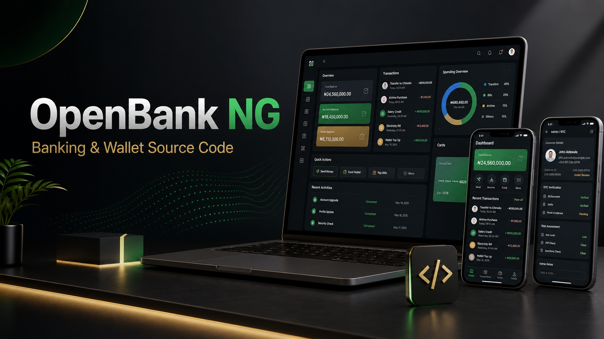

# OpenBank NG Preview

OpenBank NG is a commercial fullstack Nigerian banking and wallet infrastructure foundation for fintech founders, agencies, developers, cooperatives, and licensed financial operators.



## What This Preview Is

This public repository is a buyer preview. It is designed to help buyers understand the product, examine the package structure, review the commercial boundary, and request a deal.

The full source-code repository is private and is only shared after buyer approval, payment, and license acceptance.

## What Buyers Receive In The Full Package

- Customer banking app.
- Admin operations dashboard.
- Backend API service.
- Shared banking domain package.
- PostgreSQL-compatible schema.
- NGN/kobo money handling.
- Nigerian bank-code support.
- BVN/NIN-ready KYC workflow.
- Wallet/account workflow.
- Ledger, transfer, reversal, risk-review, OTP, trusted-device, notification, and audit boundaries.
- Setup, API, deployment, troubleshooting, handoff, release, sales, and fulfillment documentation.

## Buyer Preview Contents

```text
assets/marketplace/          Product image
artifacts/screenshots/       Customer and admin verification screenshots
docs/PRODUCT_OVERVIEW.md     Product scope and buyer value
docs/CODE_PREVIEW.md         Architecture and code-examination notes
docs/GITHUB_BUYER_ACCESS_MODEL.md
sales/DEAL_REQUEST.md        How to request access or a custom deal
release/PREVIEW_PACKAGE.md   Public-preview package manifest
LICENSE.md                   Proprietary all-rights-reserved license
```

## Pricing Recommendation

- Builder License: EUR 5,000.
- Commercial Launch License: EUR 10,000.
- Enterprise / Investor-Grade Package: EUR 20,000.

Final pricing, license, support, and buyer access are subject to seller approval.

## Compliance Notice

OpenBank NG is source-code software only. It is not a licensed bank, regulated payment processor, legal opinion, compliance certification, production security certification, direct payment-rail access, or managed production service.

Buyers are responsible for licensing, regulated provider contracts, KYC/AML provider setup, legal review, compliance review, production security audit, hosting, support operations, and go-live approval.

## Request Access Or A Deal

Review `sales/DEAL_REQUEST.md` and send:

- Company or buyer name.
- Intended use case.
- Country/market.
- Package needed.
- License need.
- Timeline.
- Budget.
- Whether custom implementation support is required.

## Full Access Rule

This preview repository is for buyer confidence only. Full source-code access is delivered through the private `openbank-ng` repository only after payment confirmation, license acceptance, approved support scope, and buyer access approval.
